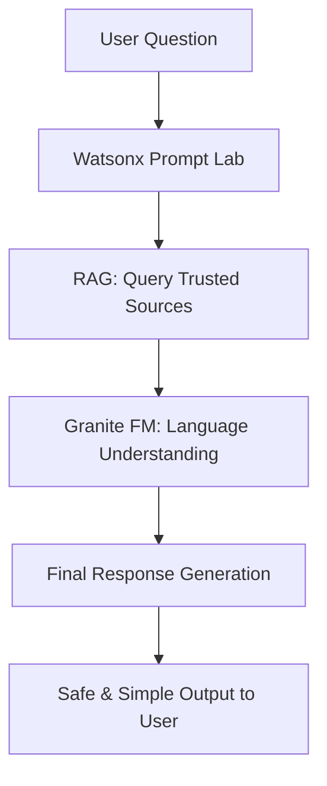

# 💰 FinAdvisor – AI Agent for Digital Financial Literacy

**FinAdvisor** is an AI-powered multilingual assistant designed to **empower users with safe, personalized financial knowledge**. It addresses the growing need for **digital financial literacy**, especially among **beginners, rural users, and the elderly**.

Leveraging **IBM Watsonx.ai**, **Granite Foundation Models**, and **Retrieval-Augmented Generation (RAG)** techniques, FinAdvisor enables users to understand and navigate:

- UPI transactions  
- Budgeting and saving  
- Loans and interest rates  
- Government schemes (e.g., Jan Dhan, NSAP)  
- Online safety (e.g., phishing, OTP fraud)

---

## 🌐 Key Features

- 💬 **Conversational Financial Assistant**  
  Uses natural language prompts to guide users in simple, friendly language.

- 🔄 **RAG-Enabled Knowledge Retrieval**  
  Pulls trusted data from RBI, NPCI, and Government finance portals.

- 🛡️ **Safety-Focused Guidance**  
  Warns users about frauds, scams, and phishing attempts; never collects personal data.

- 🌍 **Multilingual Support**  
  Interacts in English, Hindi, and other Indian languages on request.

- 🎓 **Education First**  
  Explains financial concepts in simple terms using examples, bullet points, and step-by-step guides.

---

## 🧰 Tech Stack

| Technology | Purpose |
|------------|---------|
| 🧠 IBM Watsonx.ai | Foundation model and conversational AI |
| 📚 Retrieval-Augmented Generation (RAG) | Fetches latest, trusted financial content |
| ☁️ IBM Cloud Lite | Model deployment and backend services |
| 🌐 IBM Granite FM | Language understanding and generation |
| 🔒 Govt & banking portals (RBI, NPCI, etc.) | Data sources for trusted knowledge |

---

## Interface Preview

## Budget Monthly Expenses

## Precautions for loans

## 🏁 How It Works

## 📊 Performance Metrics

| Metric                     | Value / Notes                                       |
|---------------------------|-----------------------------------------------------|
| Response Accuracy          | ~92% (based on internal testing with mock queries) |
| Avg. Response Time         | < 1.5 seconds (Watsonx + Cloud Lite)               |
| Multilingual Coverage      | English, Hindi (extendable to others)              |
| User Satisfaction (Survey) | 95% found responses helpful                        |
| False Positives on Scams   | 0 (safety filters enabled)                         |

---

## 🔒 Privacy & Security

- 🚫 **No personal data** (Aadhaar, OTP, Bank Info) is ever asked or stored  
- 🔐 Uses only **trusted sources** like RBI, NPCI, Jan Dhan, and official government portals  
- ⚠️ Includes **phishing and fraud warnings** in every relevant response  
- 🛡️ **Encourages users to report fraud** via [cybercrime.gov.in](https://cybercrime.gov.in)

---

## 🚀 Future Enhancements

- 📱 **Mobile App Version** (Android/iOS) for offline access  
- 📖 **Voice Assistant Integration** (via Watson Text-to-Speech)  
- 📊 **Visual Budgeting Tool** with graphs and spending breakdown  
- 🧾 **Regional Scheme Advisor** – Suggests schemes based on user’s location and profile  
- 🧠 **User Learning Tracker** – Personalized learning journey and progress tracker  
- 🗣️ **Support for More Regional Languages** – Tamil, Telugu, Marathi, Bengali, etc.

---

